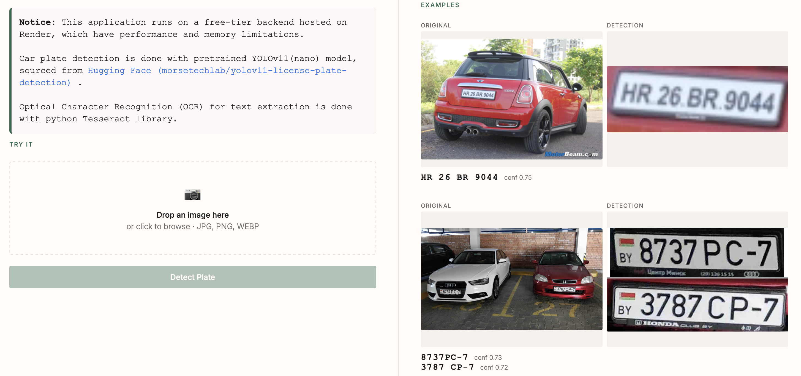

# Car Plate Recognition

This project performs automatic car license plate recognition from images. Upload an image through the web application, and the system detects the license plate and extracts its text.

Live demo: https://bekzat.app/car-plate.html

## Model

The project uses a pre-trained YOLO11 model for license plate detection from Hugging Face:
https://huggingface.co/morsetechlab/yolov11-license-plate-detection/tree/main

## Repository Structure

The repository contains two branches that differ only in the OCR engine used for text recognition.

1. tesseract-version

This branch uses pytesseract for optical character recognition (OCR). It requires fewer computational resources than deep learning-based OCR models, which makes it suitable for resource-constrained environments. However, the recognition accuracy is generally lower.

The backend for the live demo is deployed on Render’s free tier (500 MB RAM), where this lightweight solution performs reliably.

2. easy-ocr

This branch uses EasyOCR, a deep learning-based OCR library with pre-trained models. It generally provides higher recognition accuracy, especially for challenging license plate images, but requires more memory and computational resources.

EasyOCR documentation:
https://www.jaided.ai/easyocr/documentation/

## Installation

1. Clone the repository: 

git clone  https://github.com/nbekzat/car-plate-recognition.git
 
2. Create a virtual environment: 
uv venv

3. Install the dependencies:  uv add -r requirements.txt

4. Start the FastAPI application: uvicorn backend.app:app --reload

5. Start the FastAPI application: uvicorn backend.app:app --reload

The API will be available at: http://127.0.0.1:8000

## API 

Detect License Plate

Endpoint: POST /detect-plate/

Request:

* Content-Type: multipart/form-data
* Upload a single image with:
    * Key: file
    * Type: File

Tech Stack

* Python
* FastAPI
* YOLO11 (license plate detection)
* OpenCV
* EasyOCR or pytesseract
* Render (backend deployment)
* Vercel (frontend deployment)
